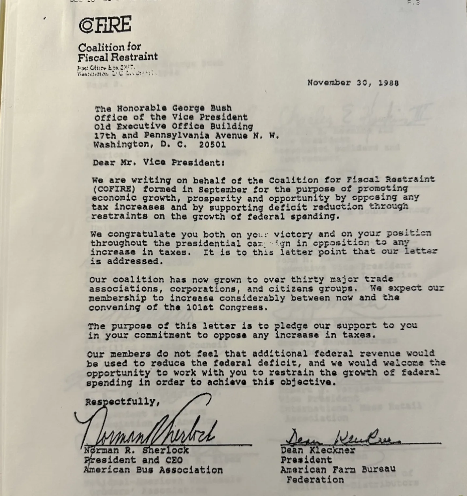

> I write entirely to find out what I’m thinking, what I’m looking at, what I see and what it means. ---[Joan Didion](https://lithub.com/joan-didion-why-i-write/)

Despite my self-imposed exile from social media, a conversation managed to still reach me from Bluesky over the last few days of my fellow historians making the point (and arguing with generative AI enthusiasts) that generative AI cannot do the work we do. This happens to exactly line up with my point a few months ago at the Western History Association conference: while I find some of the machine learning aspects of generative AI *potentially* interesting (if not yet proven actually useful), I in no way see generative AI, broadly, useful for the work we do because it cannot do the work we do.[^1]

[^1]: And before some tech bros swoop in to tell me I don't know what I'm talking about because I'm one of *those* humanities *nerds*, know that I'm also a software developer who thinks about, writes about, reads about, and even sometimes uses generative AI tools every day. I've also been a digital historian working in the world of machine learning, computation, and data visualization for over a decade. I got it.

At the [Western History Association](https://westernhistory.org) in Albuquerque back in October, I head the pleasure of joining Cameron Blevins, Rachel Birch, and Amanda Regan on the topic of generative AI for History. Given that panel and the recent discussions on social media I thought it worth trying to articulate where I stand on this in December 2025, through seven declarative statements. I've previously written some thoughts about generative AI for History [here](/2022/10/16/ai-art/) and [here](/2024/05/23/made-by-me/), and, broadly, [using this tag](/tags/artificial-intelligence/). 

## 1. Generative AI cannot understand context 

One of my earliest thoughts about generative AI---in trying to think about how it might be useful---was to envision a system ([á la Vannevar Bush](https://en.wikipedia.org/wiki/As_We_May_Think)) where an AI might be able to suggest connections or patterns among primary sources. I wondered for a time if there couldn't be made a prompt system that allowed me to ask a generative AI a question about my sources (imagine them fully transcribed, and a model trained against them) and receive useful responses in return: that sources A, B, C, F, G, and T speak to Theme 1, while some other collection of sources speak to some other theme, or these few sources seem to related to these other collection of sources. 

In short, I wanted a way to usefully query my notes and have a conversation with them. I do a lot of this sort of thing already, which I suspect many of my colleagues do as well: in my notes that I take, I'm often jotting down sources that I think speak to one another or refute one another; and, often, I'll have something like a "synthesis" note that tries to bring together various sources into some insight or idea that could represent something as small as a paragraph, or a chapter, or even the argument of a book. Could generative AI not so much streamline this process, but provide me another tool as part of this process? 

In my experience, this envisioning has fallen completely flat. I've not had a good experience in trying to get such a system in place, including training models against some corpus of transcribed sources (what's referred to as [Retrieval-Augmented Generation](https://cloud.google.com/use-cases/retrieval-augmented-generation)). It might do decently well in early conversations with a user, but it isn't particularly good at understanding broader contexts and seems, over time, to lose the thread. Plus, not only do "hallucinations" exist, [they can't be eliminated---they're mathematically inherent to LLMs](https://openai.com/index/why-language-models-hallucinate/). The work we produce as historians must be 1) trustworthy, and 2) accurately cited. Why would I ever trust a generative AI to achieve those for me? 

## 2. Generative AI cannot understand historical ambiguity 

Relatedly, generative AI is bad at understanding ambiguity. Since models work by creating text based on what it was trained on, it means that if I feed it my sources to learn from---incomplete, ambiguous, and biased as they inherently are---then that's what I'm going to get back in return. If I train one model on speeches delivered at Democratic political conventions and another on speeches delivered at Republican political conventions, I will get very different answers if I ask each model questions about cities, women, national security, natural resources, Japan, the role of federal agencies, political parties, and so on. The models can only understand what they were trained upon: ambiguous and biased sources go in, ambiguous and biased content come out. It might pretend to know something about bias if you question it, but it's unlikely to actually wrestle with it in any useful way.

Nor can generative AI (as we like to say) read against the grain or sit with the silences. Entire books have been written about what's *missing* in our archival sources: people, ideologies, events, experiences---only a fraction of human experience is ever documented anyway, and yet through our scholarly methods, professional ethics, and sophisticated readings of primary and secondary sources can we come to know things about the silences *and* the loudness of the archives. Generative AI simply cannot: again, without having something to work with, it cannot give answers. You might press it on such a question (you might ask, for example, why no women are included in a correspondence network of elites and get some reasonable response) but it's not going to consistently return to a consistent answer nor---and this is key---suggest some new way of thinking about sources. Thus,

## 3. Generative AI cannot generate new knowledge

One of the points raised by one of my fellow panelists is that generative AI, with the introduction of [reasoning models](https://machinelearning.apple.com/research/illusion-of-thinking), has gotten pretty-good-to-very-good at writing historiographical essays. That is, if I want a historiographical essay on American environmentalism I can prompt Claude or Gemini or ChatGPT to draft one for me that results in a reasonably good essay in about fifteen minutes that could plausibly pass muster for graduate-level work. That's wild.

It's also useless.

My book wouldn't exist without a historiographical essay. What drew me to write my second book about Silicon Valley was thanks in large part to Professor [Doug Seefeldt](https://www.clemson.edu/cah/about/facultybio.html?id=4341) who, in the course of an independent study with him, assigned me the task of writing a historiographical essay on what I called "New Economies in the New American West." The assignment introduced me to a body of works and approaches (environmental history, urban history) that I'd not really been exposed to previously. In fact, before I took this independent study, I thought my dissertation topic was going to be a continuation of the work I did for my Master's thesis---to continue exploring the history of the American Indian Movement.

But in writing this essay Professor Seefeldt introduced me to a variety of new works that completely reshaped my thinking: John Findlay, Margaret O'Mara, Gerald Nash, Hal Rothman, Charles Wilkinson, Carl Abbott, Kevin Fernlund, Lisa McGirr, R. Douglas Hurt, Kevin Kruse, Robert Kaplan, Arthur Gómez, Roger Lotchin, and Raye Ringholtz, to name a few, which necessarily spun off into many more authors and their scholarly or popular works. It was in the midst of writing this and thinking about all of these works collectively that I turned to Silicon Valley not as an idea or an economy, but as a *place*. [The rest is history, I guess](https://jasonheppler.org/publications/silicon-valley/).

By comparison, I just asked Claude to write me a similar historiographical essay, noting these same historians above and generally on the same topic I wrote my essay about. [It did a reasonable job](https://claude.ai/chat/725b993f-7165-4724-9631-99860518ce7b), in about eight minutes. But it's a lot less helpful than putting the time into reading the books and articles I needed to read in order to write my essay: our brains are orders of magnitude better at handling ambiguity, finding patterns, asking questions, understanding context, remembering, filtering, and synthesizing. Now imagine I didn't write my own essay but instead started here: asking a generative AI to give me an essay to inform me. Even if I wanted to take this as a starting point to understand something about the historiographical debates and evolution of environmental and urban history in the American West, this exercise would still be unhelpful. Setting aside whether it got the details, summaries, and facts correct, I'd still be left with the fact that *I hadn't read these pieces*---I can't claim to know them, or understand them, or speak to how they build off or talk to one other, or diverge from their understandings from one another; or, taken collectively, how these scholarly works try to tell us something about historical fact. My own thinking wouldn't be embedded in the writing.

And, more substantively, let's remember [how generative AI works](/2024/05/23/made-by-me/): it's trained on what already exists. It cannot create new knowledge---it's not in the archives, for one matter---and it will never be in a place to train itself on new knowledge that it itself created. At best, we're talking about software that's very good at making sentences seem sentence-shaped. Historical research, writing, and communication is considerably deeper than that.

## 4. Generative AI is toxic in classrooms

I'm stealing this one from my fellow panelist, Cameron---I said just a few months ago that generative AI [has no place in the classroom](https://bsky.app/profile/jasonheppler.org/post/3lvqmu3hrzt2k) and it's a position I still stick to. Admittedly I don't teach very often, but I have a hard time seeing the application of generative AI in the classroom. 

Part of the issue here is how generative AI undercuts learning---that is, it removes what in education we refer to as "[productive struggle](https://www.nytimes.com/2022/04/05/science/education-learning-challenge.html)." In our panel Cameron referred to this as a "friction reducer," by smoothing off areas of necessary friction where learning happens. The result, clearly, is learning *doesn't* happen. And, as I note below, the entire mode of LLMs is to give you an answer no matter what---they're designed to be agreeable and follow any line of thought or reasoning you prompt without any pushback. 

Yet that pushback is invaluable in education---some of my best moments with educators (and my colleagues) throughout my life has been when they disagreed with my ideas or pushed back against some line of thinking. Most certainly I've found this frustrating at various times, but also productive. It's the kind of thing that sharpens your thinking, or forces you to consider a question or problem from another angle, or wholly toss out ideas or arguments and consider new ones. 

The state of affairs, however, is distressing: anything I can do on a computer a generative AI could probably do as well as (and in some cases, better than) our students: analyzing primary sources, historiography, book reviews, research projects are all within the reach of generative AI. Making assignments genAI-proof is an increasingly difficult task.

> The demise of writing matters, because writing is not a second thing that happens after thinking. The act of writing is an act of thinking. This is as true for professionals as it is for students. . . . If reading and writing “rewired” the logic engine of the human brain, the decline of reading and writing are unwiring our cognitive superpower at the very moment that a greater machine appears to be on the horizon. ---Derek Thompson, [“The End of Thinking”](https://www.derekthompson.org/p/the-end-of-thinking) (2025)

## 5. Generative AI is okay at summarizing 

There's a key problem in how LLMs operate that make them pretty ill-suited for historical work: they always want to get to "yes," even if that "yes" is wrong. While I have found LLMs generally pretty poor at understanding context or relationships among primary sources or ambiguity, I'll grant that they do a decent job summarizing a document. If I feed a generative AI a set of sources to transcribe (more on that below) and also ask for a summary of the document, I find that the big models (Anthropic, Google, OpenAI) do a reasonably good job at providing me a summary. 

Let's consider an example. Here's a letter I was recently reading over from my archival research in Wyoming this summer. 

 

Transcript of the letter
 

Dear Mr. Vice President:
 
We are writing on behalf of the Coalition for Fiscal Restraint (COFRE) formed in September for the purpose of promoting economic growth, prosperity and opportunity by opposing any tax increases and by supporting deficit reduction through restraints on the growth of federal spending.
 
We congratulate you both on your victory and on your position throughout the presidential campaign in opposition to any increase in taxes. It is to this latter point that our letter is addressed.
 
Our coalition has now grown to over thirty major trade associations, corporations, and citizens groups. We expect our membership to increase considerably between now and the convening of the 101st Congress.
 
The purpose of this letter is to pledge our support to you in your commitment to oppose any increase in taxes.
 
Our members do not feel that additional federal revenue would be used to reduce the federal deficit, and we would welcome the opportunity to work with you to restrain the growth of federal spending in order to achieve this objective.
 
Respectfully,
 
[Signed] Norman R. Sherlock  Norman R. Sherlock  President and CEO  American Bus Association
 
[Signed] Dean Kleckner  Dean Kleckner  President  American Farm Bureau Federation
 
(continued)
 

I asked Claude to summarize the document, and it provided this: 

> This is a letter from the Coalition for Fiscal Restraint (COFRE) to President-elect George H.W. Bush dated November 30, 1988, shortly after his election victory. The coalition, comprising over 30 major trade associations and business groups, pledges its support for Bush's campaign promise to oppose tax increases.
> 
> The letter congratulates Bush on his electoral victory and his stance against raising taxes, emphasizing the coalition's commitment to promoting economic growth through deficit reduction via spending restraints rather than tax increases. The signatories represent a broad cross-section of American business interests, including agriculture, transportation, manufacturing, retail, energy, and various trade associations.
> 
> This document reflects the political and economic climate of the late 1980s, when deficit reduction and the "no new taxes" pledge were central issues in American politics.

Not a bad summary, although the conclusion about "reflect[ing] the political and economic climate of the late 1980s" is somewhat superficial. What would be the value in having these summaries? For me there are (potentially) two things that are helpful here: 1) it serves as a brief reminder of what the document is about, and 2) it can be resurfaced pretty easily with keyword searching. I often do small summaries in my notes anyway, and this brief overview can be helpful to quickly situate a document as I'm going through my notes. The risk here, of course, is that the summary isn't in my own words; not only that, but because I didn't think about how to write the summary it's possible I also didn't "cement" the document in my mind the same way summarizing something myself could. 

So, the summaries are good. But I'm more doubtful about their usefulness.

## 6. Generative AI is pretty good at transcription 

To an extent. Sometimes.

In some of the experimentation we've done at [RRCHNM](https://rrchnm.org) we've found that generative AI is pretty good at transcribing images of documents---I'd even go so far as to say it's the best OCR I've ever used. Some of the models even do a decently good job at both transcribing a foreign language and translating it (my colleague Amanda Madden has been experimenting with this on 16th century Italian records, and it has worked remarkably well). It also does a great job on documents that are structured: with the right amount of instruction, we've successfully had Claude read Census schedules that are organized as forms and reliably extract data that gets returned as structured data we can then visualize. We're hoping to test this kind of thing at a larger scale over a greater number of documents. 

This seems like a good use for this tool: to handle some of this routine data work that can then free up our time to do more intellectually interesting work. And in this case---of literally transcribing integers into structured data---is a different process from, say, transcribing documents by hand (that come with their own details that matter to researchers: the marginalia you might come across, the hand something is written in and if it changes, and so on). This kind of recorded data-to-structured data workflow is the sort of thing I think really could help in historical work. 

But, it comes with a caveat: we've also seen, as time goes on, that the generative AI seems to "forget" its earlier work. That is, the longer a chat happens, the less reliable an AI gets from the documents it's been working with. On a technical level, I would assume this is related to the "hallucination" problem I noted above. And, again, it leads me to wonder about any actual time-saving that happens. Do we see an error rate akin to what we might get from a research assistant? It's hard to say, currently.

## 7. Generative AI is pretty good at coding

Generative AI for programming is kind of remarkable. I'll admit to turning to these coding agents for help when I'm stuck on a problem, or need further clarity about documentation, or want the agent to handle some repetitive task. In those contexts I think generative AI works quite well. The problem, though, is turning over the work of programming fully to a generative AI---what we've come to call "vibe-coding." 

On the one hand, this is incredibly empowering. Students in a digital history course can build things in a semester that could, prior to generative AI, take considerably longer. That means building a prototype or proof of concept for a digital project can come together much more quickly: you don't have to really *know* Javascript to make a visualization or a map, and at the end of a semester (heck, even midway through a semester) you can have a working example. But, generative AI for programming offers the same trap that it's application in other facets of work lie: that is, if you are an inexperienced programmer and willingly accept what the AI offers you, you are not bringing the expertise required to know when a coding agent is wrong. Sure, what it offered might give you the desired outcome. But that doesn't necessarily mean it *works*. And, like my above examples with writing historiography or productive struggle, what are we losing if we turn over *learning* a language to *using* a language?

What worries me too, aside from the apparent disregard for the craft of coding, is the technical debt that comes with vibe-coding. If a developer has allowed a coding agent to take the wheel to produce what the developer prompt engineers[^2], and doesn't take the time to understand what it produced, what happens when something breaks? Or there's a security problem? [Technical debt](https://en.wikipedia.org/wiki/Technical_debt) is tricky enough to deal with; technical debt with no human in the mix is utterly terrifying. Computer code, after all, exists not just for the computer to follow a set of instructions. In fact, the design of many high level languages---Python, Haskell, Ruby---are designed for readability. We write code *for other humans*. Programs are precise; LLMs are inherently not.

[^2]: It's a real stretch to call this "engineering."

Not to mention the drudgery of prompt-review-accept-revise is to outsource the fun parts of being a programmer. As Simon Højberg [writes](https://hojberg.xyz/the-programmer-identity-crisis/#user-content-fnref-1), "It’s disturbing how agreeable we are to the AI hype narrative and actively participate in the planned erasure of our craft, and so willingly offer up our means of thinking." I'd hate for my programming work to be reduced to reviewing outputs, refining prompts, and pressing the return key.

---

Taken together, I cannot envision a future where generative AI and the process of writing prompts can aid our work as researchers, teachers, and communicators. It's a fundamental undervaluing of the labor, craft, and skill of our work. Promoters of generative AI like to suggest that it's here and we must adapt, or be cast aside. Or, that our students are using it ([are they?](https://www.axios.com/2025/10/19/ai-resistance-students-coders)) so we *must* find ways to incorporate it. That's hogwash.

The fundamental limit these systems face is that AI cannot bring historical expertise, critical analysis, or methodological sophistication to our work. These systems do two things, and they do them well: First, they give you an answer no matter what, even if it's completely wrong. Second, they predict the next most likely pattern to string together convincing-sounding sentences based on what they've seen before. That's it. They cannot generate new knowledge. They cannot make arguments that are genuinely surprising or original. They cannot tell you that your question is wrong or that you're looking in the wrong archive or that you've misunderstood the context. They cannot work with uncertainty the way historians must. They cannot say "I don't know" or "the evidence doesn't support any strong conclusion." They just generate plausible text.

I don't know any historian who is suggesting we outsource our analysis, our writing, or our teaching (despite what some administrators might hope). Generative AI might help with time-consuming preparatory tasks like data extraction or transcription. But here's what gives me real pause: historical research is fundamentally hands-on work with unreliable sources and incomplete records. <mark>We're trying to understand the truth of something</mark> by working with unreliable narrators, by sitting with silences and ambiguities, by learning what questions documents can and cannot answer. These AI systems are only as good as their training data. Put unreliable things in, you get unreliable things out---but without the contextual understanding to know what's unreliable or why it matters.

I think we need to be asking not "how do we adopt AI"---we need to be asking "does this actually serve the work of History?" Does it make us better historians? Writers? Educators? Does it produce better history? I'm not convinced.
