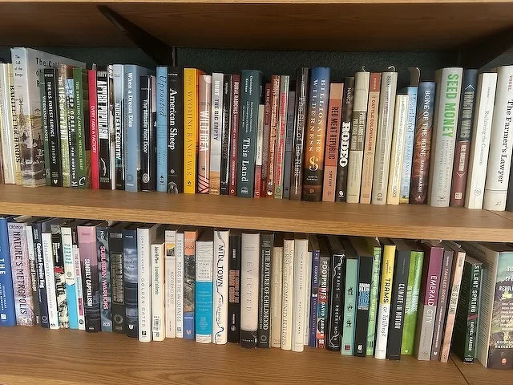
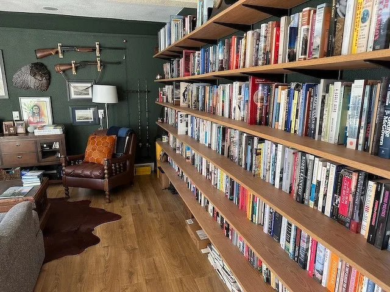
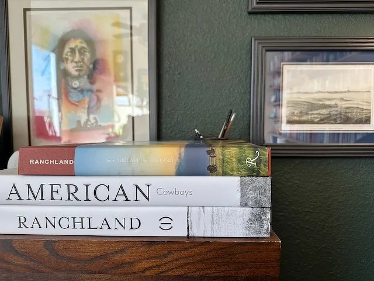
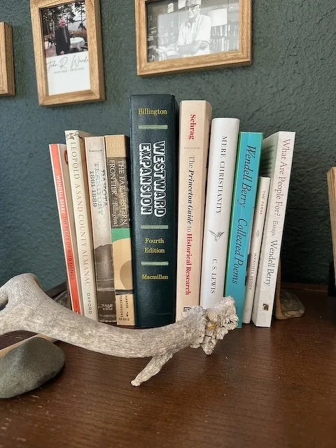
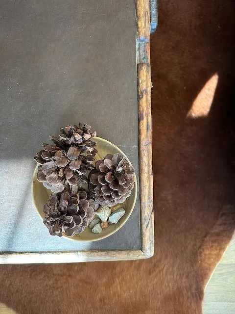
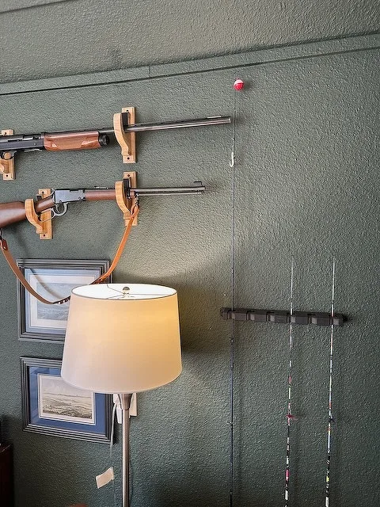
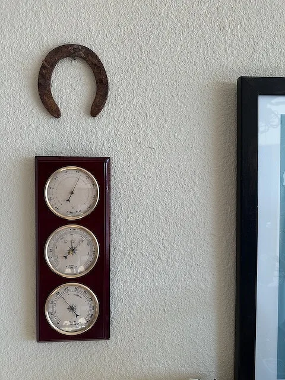
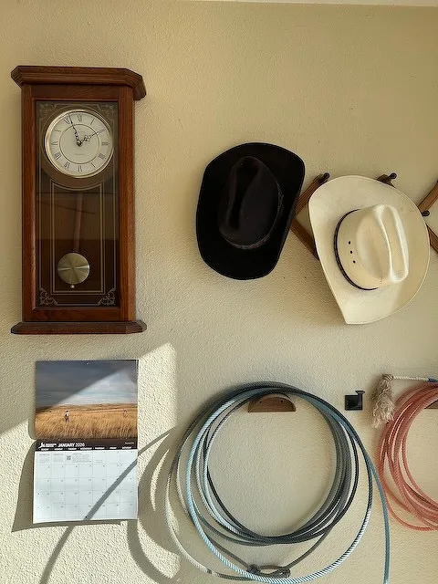

I'm in the process of slowly trying to inventory my library using [LibraryThing](https://www.librarything.com/profile/hepplerj) (where I've been for twenty years!). I'm mostly focused on physical books---I don't own many ebooks or audio books, the physical books are most near and dear to me. I estimate so far that my personal library runs around 800 books currently (on top of 50 or so ebooks and maybe 10 audiobooks). These books all reside in my home library, a space I renovated a couple of years ago to be my work-from-home space as well as my general writing studio that I refer to as the Bunkhouse.

One of the things I like to see is see other people's libraries and work spaces. I often clip these into Obsidian or Apple Notes for reference later on as a kind of "interior design" inspiration. I have lots of these: [Cormac McCarthy](https://jamierubin.net/2025/09/17/cormac-mccarthys-library/), [Wendell Berry](https://www.newyorker.com/culture/the-new-yorker-interview/going-home-with-wendell-berry), [Candice Millard](https://www.kansascity.com/entertainment/books/article102040987.html), [David McCollough](https://fromabirdseyeview.com/?tag=david-mccullough-writing-shed), [Jamelle Bouie](https://messaging-custom-newsletters.nytimes.com/dynamic/render?isViewInBrowser=true&productCode=JBO&uri=nyt%3A%2F%2Fnewsletter%2F02ab91a0-3651-59a3-bf98-26de64b1d5df), [Peter Heller](https://www.nytimes.com/2014/06/19/garden/he-found-his-corner-of-the-sky.html), and many others. I think of these the same way we might look at architectural magazines or (my other favorite) wood shops (like [Nick Offerman](https://offermanwoodshop.com/film-photo-rental/) or [Adam Savage](https://parkzer.com/2024/06/15/adam-savage-cave/)): they’re creative spaces where people I admire do their work, and I’m always intrigued on how other creatives use their space. 

Heading out to my work space is walking into my ideal library: the design, the book subjects, (the coffee), all tailored to my interests and needs.
