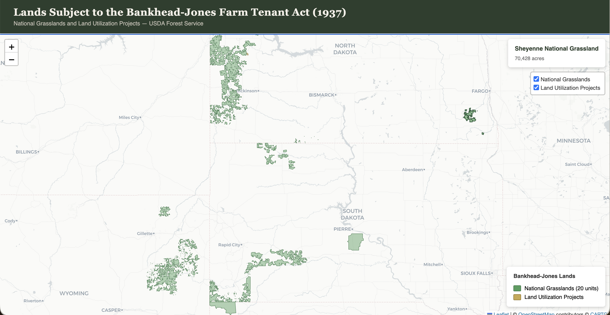

One thing I've been thinking about is a persistent critique---one I've expressed myself and think is completely valid---that code generated by Claude or Codex immediately becomes technical debt. That is, it's tantamount to producing spaghetti or legacy code that you cannot understand because you did not write it (which, of course, is [a similar concern](/2025/12/22/generative-ai-and-the-work-of-history/) I have about generative AI producing things like historiographical essays). 

But as my pal Lincoln Mullen [just wrote](https://lincolnmullen.com/blog/behind-ahead/), the barrier to entry for most things we do in digital history---building websites, creating maps, designing data visualizations, preparing data---can be reduced considerably. I've spent my career building these kinds of skills to do this kind of work, and now a machine can do them in a fraction of the time it takes me.[^3] Here's an example. 

[^3]: I find this predicament both humbling but also exhilarating. If doing less of the heavy tech work means I can do more of the history work, I think that's a great leap in the right direction.

I am in the throes of a research project for a book on the politics around land, agriculture, environmentalism, and land management on the Great Plains. It occurred to me recently that I need to stretch my timeline backwards a bit to the Bankhead-Jones Act of 1937. I'll save a fuller history for some other time, but in short: Bankhead-Jones empowered the federal government to purchase just over 11 million acres of farmland deemed "submarginal." The administration of the program traveled from the Bureau of Agricultural Economics until 1938, to the Soil Conservation Service until 1953, to the U.S. Forest Service which continues the administration of these lands today. Importantly, however, this established a federal presence across a region that had been almost entirely in private hands.

I wanted to see these lands, in part because one thing that's complicated about writing this regional history I'm working on is the quilted patchwork of public and private land ownership and management that happens on the grasslands. So I asked [Claude](https://code.claude.com/docs/en/overview): without any input from me, find the data and make this map. It took about fifteen minutes. 

[Here's the interactive version](/projects/bankhead/). This is the kind of thing I've been building for years---an interactive map of data to understand more clearly how something worked or influenced a place. A map of this nature would've taken me, at best, half a day: finding the data, doing any data formatting necessary for a web map, making the website, making the map filterable or interactive. Claude did everything with no input from me in fifteen minutes.[^1]

[^1]: If I intend to do more with this map I'd probably take over the design work on this since I like doing that sort of thing. But the routine work of setting up the map and data means I can move on to things more intellectually satisfying.

Generative AI is really bad at doing history. But it *can* enable me to do good history. 

---

Back to technical debt. In something like this I think it matters a lot less about whether I know how this was made. First, the code is small enough that it's easy for me to know what it did. And, frankly, generative AI (given the right prompts) is very disciplined about documenting code. Second, this isn't a big system. If I were working on software for a bank, a large Internet service company, or Apple, that'd be one thing---I think the time investment perhaps doesn't pay off as well because you need to really pay attention to what coding agents are doing.[^2] 

The point here is that if these tools are enabling a software developer with a decade of experience in digital humanities to create things in a fraction of the time it once took, then these tools are phenomenally *empowering* for someone just starting out or with almost no coding experience at all. In this case I think there really isn't a debt: it's a small or one-off visualization, not a complex system. Rather than a debt, this is an investment in one's intellectual work. The rote or routine work can free up your time to focus on the *history* rather than the *technology*. Not to speak for my fellow digital historians, but I think that's been the point this whole time: the technology was a means to an end---of doing new kinds of history that we couldn't do (at least, not as easily) without digital tools. Generative AI has shifted this considerably.

[^2]: Coding agents are good, but not great. I still frequently catch things from unused variables it assigned to more efficient ways of achieving a solution. The agents still tend to be rather boilerplate in their solutions---but that's not always a bad thing.