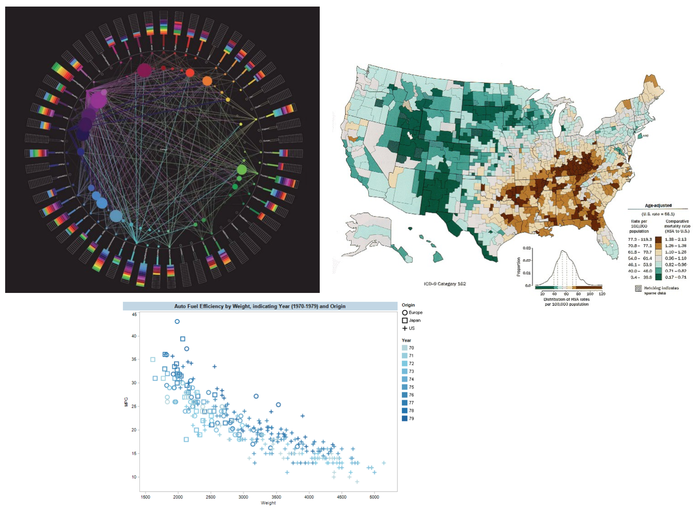
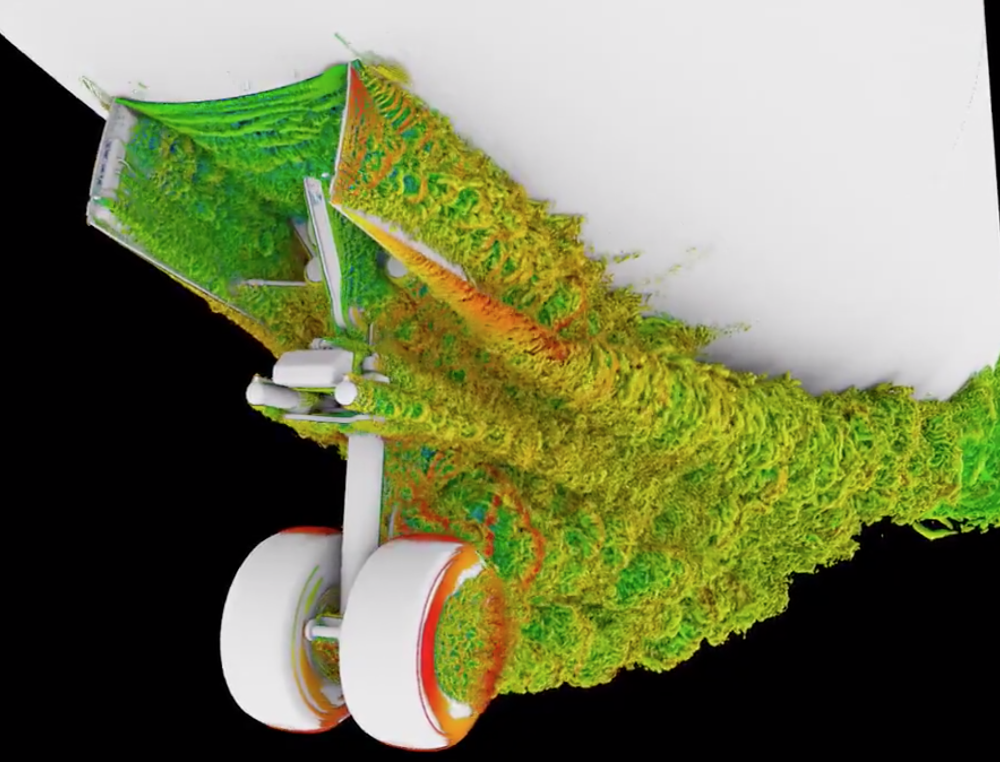
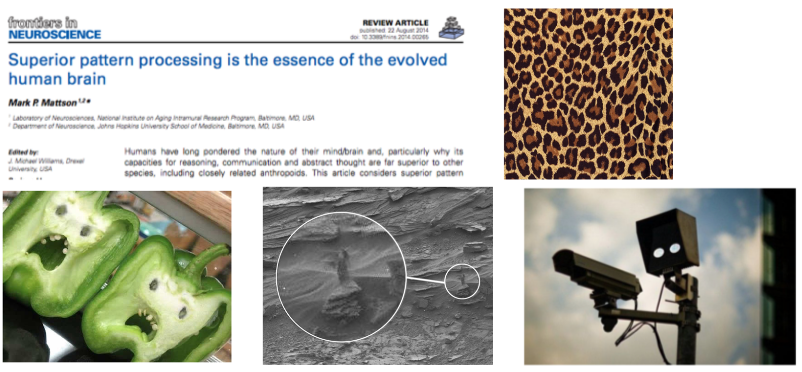
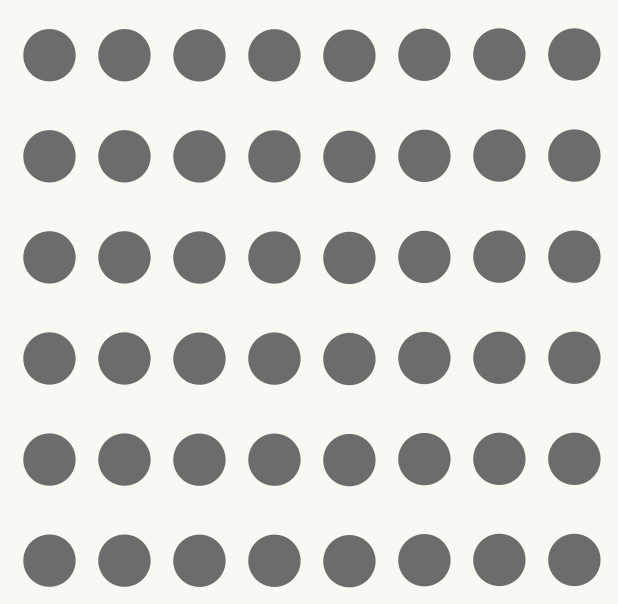
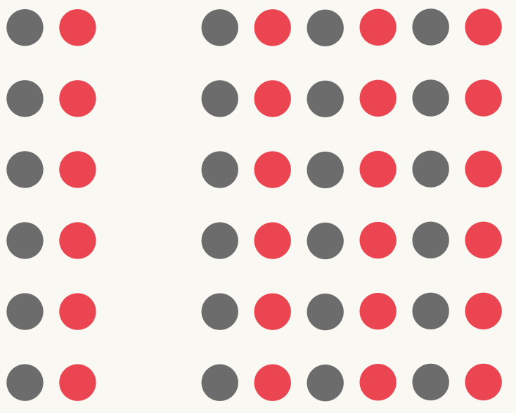
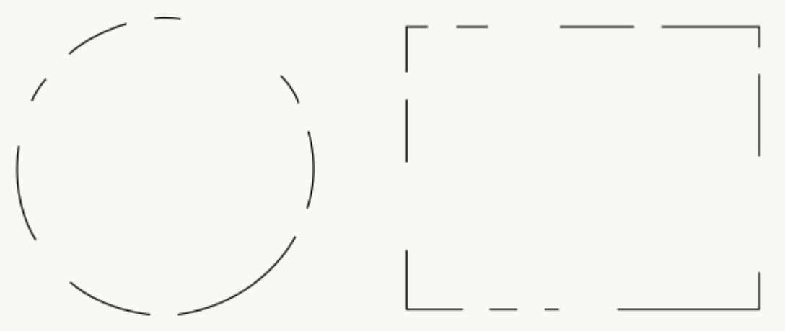
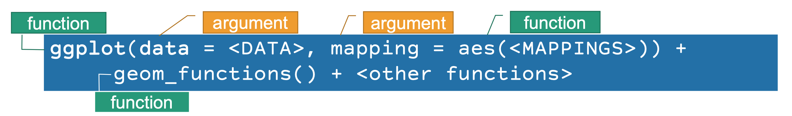
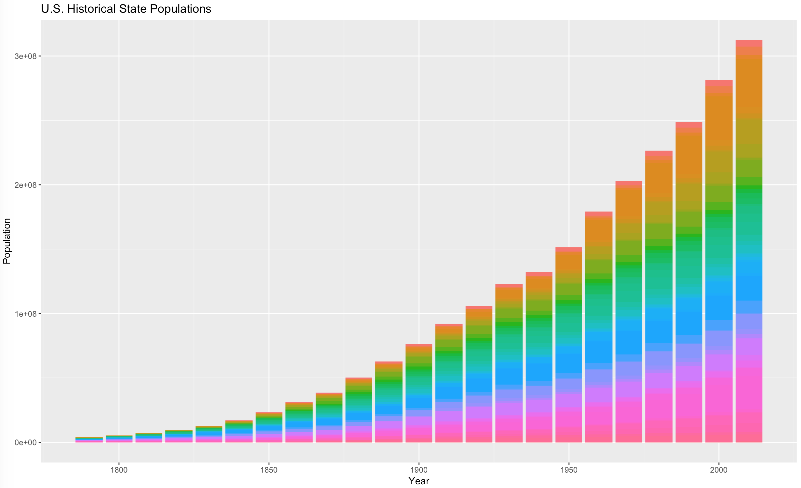

class: fullscreen, inverse, bottom, left, text-white
background-image: url("images/me-speaking.jpg")

.font150[**Hi, I'm Jason. <br>I like to gesture at screens.**]

**Digital Engagement Librarian**, University of Nebraska at Omaha<br>Mentor, **Mozilla Open Leaders**<br>Researcher,  **Humanities+Design**, Stanford University


```{r setup, include=FALSE}
knitr::opts_chunk$set(fig.width=4.25, fig.height=3.5, fig.retina=3,
                      message=FALSE, warning=FALSE, cache = TRUE, 
                      autodep = TRUE, hiline=TRUE)
knitr::opts_hooks$set(fig.callout = function(options) {
  if (options$fig.callout) {
    options$echo <- FALSE
    options$out.height <- "99%"
    options$fig.width <- 16
    options$fig.height <- 8
  }
  options
})
hook_source <- knitr::knit_hooks$get('source')
knitr::knit_hooks$set(source = function(x, options) {
  if (!is.null(options$hiline) && options$hiline) {
    x <- stringr::str_replace(x, "^ ?(.+)\\s?#<<", "*\\1")
  }
  hook_source(x, options)
})
options(htmltools.dir.version = FALSE, width = 90)
as_table <- function(...) knitr::kable(..., format='html', digits = 3)
```

---
layout: true
# Plan for today
---

- Understand the fundamentals of `ggplot2`

- Aesthetics and design

- Hands-on with ggplot

---
layout: false

# Visualization Design

Edward Tufte suggests that graphical excellence is defined by "that which gives the viewer the **greatest number of ideas**, in the **shortest time**, with the **least ink**, the **smallest space**, and which **tells the truth about data**."

<span class="smaller">
Edward Tufte, *The Visual Display of Quantitative Information* (Graphics Press, 1983).
</span>


---
layout: false

# Why visualize?

---
layout: false

# Why visualize?

- For the .hl[exploration] of data and evidence

---
layout: false

# Why visualize?

- For the .hl[exploration] of data and evidence
- For the .hl[communication] of information and results

---
layout: false

# Types of visualization

- .hl[Information visualization]: statistical charts and graphs to represent data

---
layout: false
class: center, middle



---
layout: false

# Types of visualization

- .hl[Information visualization]: statistical charts and graphs to represent data
- .hl[Scientific visualization]: scientific data that has close ties to real-world objects with spatial properties

---
layout: false
class: center, middle



---
layout: false

# Types of visualization

- .hl[Information visualization]: statistical charts and graphs to represent data
- .hl[Scientific visualization]: scientific data that has close ties to real-world objects with spatial properties
- .hl[Infographic]: combining statistics and visualizations with a narrative

---
layout: false
class: center, middle


---
layout: false

# Visual design




---

# Gestalt psychology

We refer to this as .hl[Gestalt psychology], an old practice for understanding how humans perceive patterns. The principles of Gestalt psychology attempt to explore how we view separate visual elements as a whole.

<center>

</center>

---

# Gestalt psychology

.hl[Similarity]. Objects that are visually similar (the same color, the same shape, etc.) are perceived as part of the same group.

<center>

</center>

---

# Gestalt psychology

.hl[Proximity]. Humans perceive objects close together as being part of a single group.

<center>

</center>

---

# Gestalt psychology

.hl[Closure]. Humans tend to fill in the blanks when presented with missing information. When viewing a shape with missing segments, we perceive it as a single unit.

<center>

</center>


---
layout: true
# Let's get started!
---

**Easy**: install the [tidyverse](http://tidyverse.org)

```r
install.packages('tidyverse')
```

**Expert**: install from GitHub

```r
devtools::install_github('tidyverse/ggplot2')
```
And since we'll need it later:

```r
install.packages(c('historydata', 'gapminder'))
```

---

.left-column[
### ggplot

]

.right-column[
The `tidyverse` is a collection of several packages useful for data manipulation, tidying, and visualization.

- `ggplot2`, for data visualization
- `dplyr`, for data manipulation
- `tidyr`, for data tidying
- `readr`, for data import
- `purrr`, for functional programming
- `tibble`, a re-imagining of data frames
]

---

.left-column[
### ggplot

]

.right-column[
ggplot2 is a data visualization package that uses

- a grammer of graphics: breaking up graphs into components
- popular method for creating explanatory and exploratory graphics

Supplementary packages for ggplot are available for more customization and function, for example:

- `gganimate`: create animations
- `gghighlight`: highlight lines and points
- `ggrepel`: automatic adjustment of text labels
- `ggbeeswarm`: add non-overlapping points
]

---
layout: true
# Grammar of Graphics
---

`ggplot` has three essential components:

- **data**: a dataset you are visualizing
- **aesthetic mappings**: that identify coordinates (what to map to x and y), and assigning variables to visual elements (color, shape, size, etc.)
- **geometric layer**: a type of graphic (point, line, boxplot, bars, maps, etc.)

---



- `geom_*`: type of graphic
- `stat_*`: statistical representation of the data
- `scale_*`: visual values (axis scale, color scale)
- `facet_*`: divide plot into subplots
- `theme(_*)`: adjust background colors, grid lines, font sizes, etc.


---
layout: false

# The Grammar of Graphics

A visualization concept created by Leland Wilkinson (1999) to **define** the elements of statistical graphics:

> "... describes the meaning of what we do when we construct statistical graphics ... More than a taxonomy ... Computational system based on the underlying mathematics of representing statistical functions of data."

Adapted by the creator of `ggplot`, Hadley Wickham, in 2009. `ggplot` offers a:
> 1. **consistent and simple syntax** for 
> 2. **describing statistical graphics**, and is
> 3. **highly modular** to break graphs into 
> 4. **semantic components**. 

*See* Hadley Wickham, "A Layered Grammar of Graphics," *Journal of Computational and Graphical Statistics* vol. 19 no. 1 (2010): 3--28 <http://vita.had.co.nz/papers/layered-grammar.pdf>.

---
layout: false

# Population data

```r
library(tidyverse)
library(historydata)
data(us_state_populations)
```

---
layout: false

# Population data

```r
library(tidyverse)
library(historydata)
data(us_state_populations)

# Let's look at the first five rows
us_state_populations %>% head(5)
```

```
## Source: local data frame [5 x 4]
## 
##   GISJOIN  year         state population
##     (chr) (int)         (chr)      (int)
## 1    G090  1790   Connecticut     237655
## 2    G100  1790      Delaware      59096
## 3    G130  1790       Georgia      82548
## 4    G240  1790      Maryland     319728
## 5    G250  1790 Massachusetts     475199
```

---
layout: false

# A ridiculous example

```r
library(tidyverse)
library(historydata)
data(us_state_populations)

# Let's look at the first five rows
us_state_populations %>% head(5)

# Let's plot the data
ggplot(data = us_state_populations, aes(x = year, y = population, fill = state)) +
  geom_bar(stat="identity") +
  ggtitle("U.S. Historical State Populations") +
  theme(legend.position="none") +
  labs(x = "Year", y = "Population")
```

---
layout: false

# A ridiculous example



---
layout: false

# The Grammar of Graphics

Let's break down what we did with the `ggplot` code. The code for our previous bar chart looked like:

```r
ggplot(data = us_state_populations, aes(x = year, y = population, fill = state)) +
  geom_bar(stat="identity") +
  ggtitle("U.S. Historical State Populations") +
  theme(legend.position="none") +
  labs(x = "Year", y = "Population")
```

---
layout: false

# The Grammar of Graphics

Let's break down what we did with the `ggplot` code. The code for our previous bar chart looked like:

```r
ggplot(data = us_state_populations, aes(x = year, y = population, fill = state)) +
  geom_bar(stat="identity")
```

---
layout: false

# The Grammar of Graphics

Let's break down what we did with the `ggplot` code. The code for our previous bar chart looked like:

```r
ggplot(data = us_state_populations, aes(x = year, y = population, fill = state)) +
  geom_bar(stat="identity")
```

`ggplot` needs:

> 1. mapping of **data**
> 2. to **aesthetic attributes**
> 3. using **geometric objects**
> 4. with data **statistically transformed**
> 5. and, if needed, mapped onto a **facet** or **coordinate system**

---
layout: false

# The Grammar of Graphics

**data**: data as an R data frame 

**coordinate system**: describe 2D space data is projected onto, such as Cartesian coordinates, polar coordinates, and map projections.

**geoms**: describe the geometric objects that represent data, such as points, lines, and polygons.

**aesthetics**: describe visual characteristics that represent data, such as position, size, color, and shape. 

**scales**: for each aesthetic, describe how visual characteristic is converted to display values, such as log scales, color scales, size scales, and shape scales.

**stats**: describe statistical transformations such as counts, means, medians, or regression lines.

**facets**: describe how data is split into small multiples.

---
layout: false

# The Grammar of Graphics

Let's break down what we did with the `ggplot` code. The code for our previous bar chart looked like:


```r
ggplot(data = us_state_populations, aes(x = year, y = population, fill = state)) +
  geom_bar(stat="identity")
```

Mapping of **data**:

```r
data = us_state_populations
```

to **aesthetic attributes**:


```r
aes(x = year, y = population)
```

---
layout: false

# The Grammar of Graphics

Let's break down what we did with the `ggplot` code. The code for our previous bar chart looked like:

```r
ggplot(data = us_state_populations, aes(x = year, y = population, fill = state)) +
  geom_bar(stat="identity")
```

using **geometric objects**:

```r
geom_bar(stat="identity")
```

<span id="smaller">
See the `ggplot` [`geom_bar` documentation](http://docs.ggplot2.org/current/geom_bar.html) for the differences in the `stat` flag. By default, `geom_bar` uses "stat='count'" which sets the height of the bar proportion to the number of cases in each group. Since we want the height of the bars to represent values in the data, we use "stat='identity'" to map a variable to the `y` aesthetic.
</span>

---
layout: false

# The Grammar of Graphics

with data **statistically transformed**

Name      | Description 
----      | -----------
bin       | Divide continuous range into bins, and count number of points in each
boxplot   | Compute statistics necessary for boxplot
contour   | Calculate contour lines
density   | Compute 1d density estimate
identity  | Identity transformation, f (x) = x
jitter    | Jitter values by adding small random value
qq        | Calculate values for quantile-quantile plot
quantile  | Quantile regression
smooth    | Smoothed conditional mean of y given x
summary   | Aggregate values of y for given x
unique    | Remove duplicated observations

and, if needed, mapped onto a **facet** or **coordinate system**

---
layout: false
class: center, middle

.font150[
R makes the production of these graphics simple. Note that we were able to create a barchart with two lines of code.]

---

layout: false
class: inverse, center, middle

.font150[
Open the file <https://bit.ly/2BXUU0W>. Copy and paste into RStudio and follow along to practice the grammar of graphics.
]